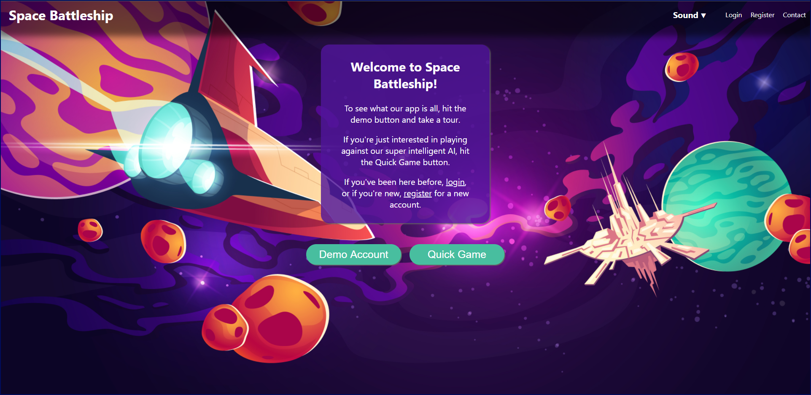

# Space Battleship
Space Battleship is a mobile first web app designed to allow users to play battleship with AI and other users.
Check out [Space Battleship](https://spacebattleship.vercel.app/)

## Summary
Users can create accounts, track stats, and play battleship with an AI or other users. Users who are not registered can login to a demo account to see how the app works before signing up for an account. This app uses the Space Battleship API to handle HTTP requests. see the documentation for the API here: [Space Battleship API](https://github.com/mloldacre/battleship-server-jmkbh)

## App Screens
The app has 9 main page views. The components for each page view are found in the routes directory. Smaller components that are part of each screen, both unique and reused, are found in the components directory.

### Landing Page
The landing page gives new users a brief description of the app and its purpose. 
<em></em>

### Login Page
From the Landing Page users can view the Login Page. Already registered users can log in here. New users can click the link to create an account. A demo user account is also available to allow new users to try out the app as well. 
<em>[placeholder for screenshot]</em>

### Registration Page
The registration page is for new users to create an account. If you already have an account, you can click on a link that will redirect you to the login page. 
<em>[placeholder for screenshot]</em>

### Contact Page
The contact page is for any user to view the people who worked very hard on Space Battleship and look at their portfolios. 
<em>[placeholder for screenshot]</em>

### Dashboard Page
The dashboard page is where users can choose to view stats or select which game version to play 
<em>[placeholder for screenshot]</em>

### Stats Page
The stats page is where the user can see all of their game related stats 
<em>[placeholder for screenshot]</em>

### Game Page
The game page is where the user can choose to begin a game or quit, place ships on their board and battle an AI 
<em>[placeholder for screenshot]</em>

### Quickgame Page
The quick game page is where a user who wants to just play a game without signing in or tracking their stats can place ships on their board and battle an AI 
<em>[placeholder for screenshot]</em>

### Random Game Page
The random game page is where a user can play a game with a random other user on the web, place ships and battle for dominance 
<em>[placeholder for screenshot]</em>

## Stack
Create-React-App was used to bootstrap the project.
React Router(DOM) was used to handle navigation through page views.
ToneJS was used to implement game sounds and background music throughout the application.
Socket.io Client was used to handle chat and multiplayer games.
Testing used the Jest test framework.
